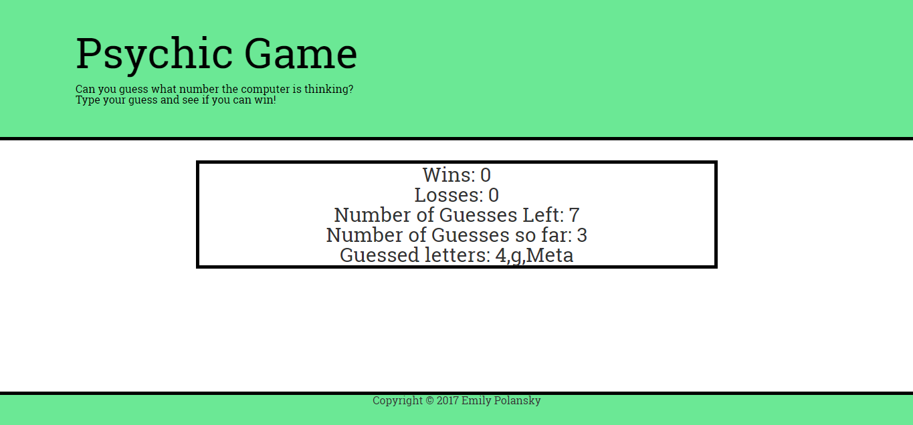

# Psychic-Game

The computer randomly generates a number. 

The user must then try and see if they can correctly guess the number that the computer is thinking of. 

To guess the user must hit the number they want on the keyboard.

The user is notified if they are correct or incorrect.

The user is given 10 tries to guess the computer's number before the computer generates a new number.

## Languages and Packages Used

This application uses HTML, CSS, Bootstrap, and JavaScript.

